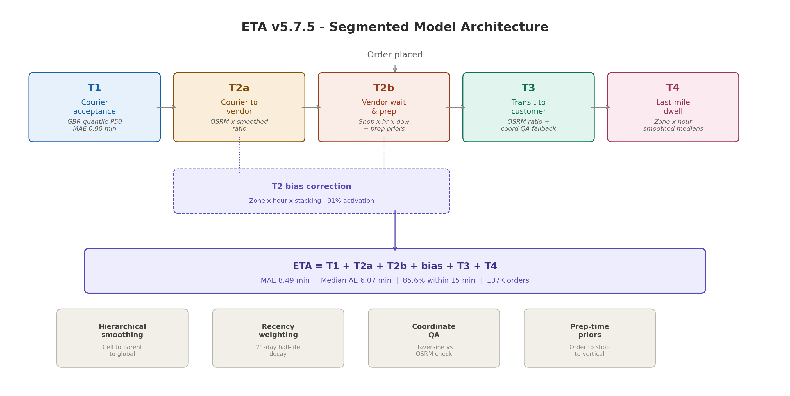

# Estimated Time of Arrival (ETA) Prediction Model

A segmented ETA prediction system for on-demand food delivery that decomposes the order lifecycle into independently modeled stages, using hierarchical Bayesian smoothing, recency-weighted calibration, and gradient-boosted residual correction.

**Industry:** On-Demand Food Delivery (MENA Region)  
**Role:** Senior Performance Analyst | Designed and built the ETA modeling framework end-to-end  
**Tools:** Python, Scikit-learn, OSRM, Pandas, NumPy  
**Validation Set:** 137,081 orders with ground-truth timestamps  

---



## Problem

The platform displayed a static, upper-bound ETA at order placement, routinely overestimating by 30-40 minutes. A restaurant less than 1 km away showed "Delivering in 1 hour" while the order arrived with 41 minutes still on the clock. This eroded customer trust and distorted operational metrics.

An earlier attempt at a standalone food prep-time model achieved reasonable vendor-level accuracy but couldn't capture the full delivery journey. Courier matching delays, real-world transit conditions, and last-mile dwell time were unaccounted for.

## Approach

### Segmented Architecture

The model decomposes each delivery into five stages, each predicted independently:

| Segment | Phase | Method |
|---------|-------|--------|
| **T1** | Order created to courier accepted | Gradient-boosted quantile regression (P50) |
| **T2a** | Courier accepted to arrived at vendor | OSRM duration x recency-smoothed ratio |
| **T2b** | Arrived at vendor to left vendor | Hierarchical smoothing with prep-time priors |
| **T3** | Left vendor to arrived at customer | OSRM duration x smoothed ratio (with coordinate QA fallback) |
| **T4** | Arrived at customer to order delivered | Zone x hour smoothed dwell medians |

**Final ETA = T1 + T2a + T2b + T3 + T4**

T2b captures vendor preparation and wait time, the hardest segment to predict, by blending three tiers of prep-time priors (order-level, shop-level, vertical-level) with recency-weighted historical data.

### OSRM Ratio Calibration

OSRM (Open Source Routing Machine) provides ideal shortest-path driving estimates. Real-world deliveries differ due to traffic, parking, building access, and courier behavior. The model learns a calibration ratio from historical GPS traces:

```
predicted_time = osrm_duration * smoothed_ratio(zone, hour, distance_bin)
```

Ratios are computed using **recency-weighted medians** with configurable half-life decay (21 days default), giving more weight to recent deliveries while retaining signal from older data.

### Hierarchical Bayesian Smoothing

Raw cell-level ratios (zone x hour x distance bin) can be noisy when sample sizes are small. The model applies empirical Bayes shrinkage with a parent hierarchy:

```
smoothed_ratio = (n_cell * ratio_cell + n0 * parent_ratio) / (n_cell + n0)
```

The parent hierarchy cascades through increasingly broad aggregations: `zone x hour x dist` to `hour x dist` to `peak x dist` to `hour` to `peak` to `global`. This ensures every prediction has a reasonable estimate, even for rare combinations.

### Coordinate Quality Assurance (T3)

Before applying OSRM ratios for transit prediction, each order's coordinates are validated:

- **Bounding box check** - coordinates must fall within the KSA geographic extent
- **Zero-coordinate detection** - catches GPS failures
- **Haversine vs OSRM mismatch** - flags cases where straight-line and routed distances diverge beyond thresholds (ratio above 3x or below 0.33x)

Flagged orders fall back to a zone x hour baseline model built from validated historical actuals instead of unreliable OSRM estimates.

### T2 Bias Correction

After T2a + T2b prediction, a final bias correction layer addresses systematic over/under-estimation. Bias is computed per zone x hour x stacking bucket using recency-weighted medians and smoothed against parent levels. Correction activates only when the bias exceeds a minimum threshold (|bias| >= 0.5 min) and the supporting cell has sufficient observations (n >= 12).

### Feature Set

**T1 Model (Gradient Boosting):**
- Categorical: zone, vendor chain, cuisine vertical, shop ID
- Numeric: stacking order count, active/rejected courier counts, coordinates, hour, day-of-week

**T2/T3 Ratio Models:**
- Zone, hour of day, distance bin (8 bins from under 1 km to 20+ km)
- Peak hour flag (14:00-22:00)
- Recency weights with exponential decay

**T2b Prep-Time Priors:**
- Order-level prep times (shop x vertical x hour x day-of-week)
- Shop-level aggregates (median, IQR, count)
- Vertical-level fallbacks

## Results

### Model Accuracy by Segment

| Phase | MAE (min) | Median AE (min) |
|-------|----------:|----------------:|
| T1 - Courier Acceptance | 0.90 | 0.24 |
| T2 (raw) | 6.99 | 5.00 |
| T2 (corrected) | 6.92 | 5.14 |
| T3 - Transit | 3.79 | 2.09 |
| **End-to-End ETA (corrected)** | **8.49** | **6.07** |

### Prediction Error Distribution (137K orders)

| Error Band | Orders | Share |
|-----------|-------:|------:|
| <= 2 minutes | 24,529 | 17.9% |
| <= 5 minutes | 58,083 | 42.4% |
| <= 10 minutes | 98,014 | 71.5% |
| <= 15 minutes | 117,319 | 85.6% |
| > 15 minutes | 19,762 | 14.4% |

### Coverage

- **T2a (OSRM ratio):** 96.5% of orders had cells with >= 25 historical observations
- **T2b (shop x hour x dow):** 29.1% direct cell coverage
- **T2 bias correction:** Activated on 91% of orders

## Validation Design

The model was validated on 137,081 orders from the most recent month of data, using a temporal split (80/20 train/test by order creation timestamp) to prevent data leakage. This is important because recency weights mean recent orders influence ratio tables heavily, so a random split would overstate accuracy.

**Key validation choices:**
- Temporal split, not random split. Orders in the test set are strictly later than all training orders.
- Ground truth is computed from raw event timestamps (order created, courier accepted, pickup arrived, pickup departed, dropoff arrived, order delivered), not from any platform-reported ETA.
- Each segment (T1, T2, T3) is evaluated independently and then as an end-to-end sum, so we can attribute error to the right stage.
- Guardrails clip predictions to sane ranges (e.g. T2 between 0.5 and 240 minutes) to prevent extreme outliers from distorting MAE.

**Assumptions:**
- OSRM ratios are relatively stable within a 21-day window for a given zone x hour x distance bin. This holds for most zones but breaks down during Ramadan or major events.
- Courier GPS traces accurately reflect real travel times. In practice, couriers sometimes mark "arrived" before physically arriving, which adds noise to T2a actuals.
- The coordinate system is consistent. In reality, about 3-5% of orders had swapped or zero coordinates, which the QA pipeline catches.

## Limitations and What I Would Test Next

**Known limitations:**
- T2b (vendor wait time) remains the largest error source. Kitchen readiness depends on factors we cannot observe: staff levels, equipment availability, order complexity, simultaneous dine-in load. The model captures average patterns but not real-time kitchen state.
- Drop-off coordinate quality is the main driver of T3 outliers. The haversine vs OSRM check catches gross errors, but subtle misplacements (e.g. coordinates pointing to the street vs. inside a gated compound) still inflate T3.
- The model was built and validated on Riyadh data. Transferring to other cities would require retraining the ratio tables and potentially retuning smoothing constants.
- Bias correction is a patch, not a root-cause fix. A properly calibrated model should not need post-hoc bias tables.

**What I would test next:**
- Conformal prediction intervals instead of point estimates, to give customers a range (e.g. "25-35 min") rather than a single number.
- Real-time features for T2b: current kitchen queue length, time since last completed order at the same vendor, recent prep times from the same restaurant in the last hour.
- A geocoding validation layer for drop-off coordinates, matching against building polygons to catch subtle GPS misplacements before they reach the T3 model.
- Retraining frequency experiments: is 21-day half-life optimal, or would shorter/longer decay improve accuracy for different segments?

## Key Learnings

1. **Segmentation isolates bottlenecks.** Splitting T2 into T2a (courier travel) and T2b (vendor prep/wait) revealed that vendor-side delays, not courier travel, drive most of the prediction error. This directed improvement efforts to the right place.

2. **Hierarchical smoothing solves the cold-start problem.** New zones, off-peak hours, and rare distance bins naturally inherit sensible predictions from parent-level aggregates rather than defaulting to a single global average.

3. **Recency weighting matters.** Delivery patterns shift as new restaurants open, traffic patterns change, and courier fleets grow. Exponential decay weights (21-day half-life) ensure the model adapts without discarding older signal entirely.

4. **Coordinate quality gates prevent garbage-in-garbage-out.** Around 3-5% of orders had problematic drop-off coordinates. Without the haversine vs OSRM mismatch check, these would have inflated T3 errors and been invisible in aggregate metrics.

5. **Bias correction had broad applicability.** The zone x hour x stacking correction layer activated on 91% of validation orders, showing that local systematic bias was common enough to justify a dedicated correction step.

## Repository Structure

```
README.md
src/
  utils.py                      # Shared utilities (haversine, smoothing, recency weights)
  osrm_enrichment.py            # OSRM route fetching and calibration table generation
  eta_model_v5.py               # Core ETA model (v5.1) - T1 + T2 + T3 + T4
  eta_model_v5_7.py             # Final model (v5.7.5) - T2a/T2b split, coord QA, prep priors
notebooks/
  eta_methodology_walkthrough.ipynb  # Step-by-step methodology explanation
config/
  model_config.yaml             # Hyperparameters, smoothing constants, guardrails
diagrams/
  eta_architecture.png          # Model architecture diagram
requirements.txt
.gitignore
```

## How to Run

```bash
pip install -r requirements.txt

# Step 1: OSRM enrichment (requires local OSRM server)
python src/osrm_enrichment.py

# Step 2: Train and evaluate ETA model
python src/eta_model_v5_7.py
```

> **Note:** This repository contains the complete modeling methodology and code. Production data is excluded due to confidentiality. The code expects enriched order CSVs with the column schema documented in the config file. A methodology walkthrough notebook is provided for understanding the approach without production data.
